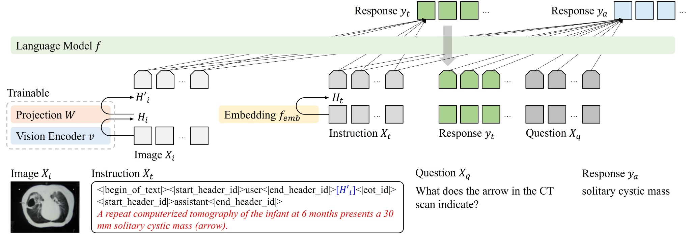

# medcap: LLM-Powered Medical Image Captioning and Visual Question Answering



## Introduction

**Why Fine-Tune Only the Vision Encoder?**
We assume that publicly available instruction-tuned LLMs (e.g., Meta-Llama-3-8B-Instruct) have high generalization capabilities.
Instead of struggling to prevent LLM overfitting, we freeze LLM parameters during fine-tuning and focus on enhancing the vision input.
By using vision encoders compatible with LLMs that offer high-quality representation, this approach is expected to leverage the LLMs' generalization abilities, reducing concerns about overfitting to in-house data.
Moreover, a vision encoder trained with LLMs enables high-quality feature extraction, which is expected to show superior performance in various downstream tasks.

Key features added in this repository include:
- Enabling LLMs to process image inputs.
- Training the vision encoder while keeping the LLMs frozen.

**Backgrounds.**
When using Large Language Models (LLMs) with in-house data, we often experience that LLMs do not perform as well as they do with natural images.
To address this, people construct an in-house instruction dataset and use it to fine-tune LLMs.
However, even with this fine-tuning, the models still struggle with out-of-scope inputs (i.e., overfitting), manifesting as:
- Degraded performance in **external** validation.
- Poor responses to **unexpected** questions.
- **Overfitting** to the training chat format (e.g., weak performance in visual question-answering tasks when fine-tuned with image-caption pairs).

These weaknesses arise from several factors:
- **Limited Samples:** In-house datasets may have an insufficient number of samples, limiting the model's ability to generalize effectively.
- **Insufficient Information:** The training samples might lack the necessary breadth and depth, hindering the model's training.
- **Limited Representation:** Even though the vision encoder is trained on a diverse dataset, substantial domain gaps in the in-house data limit its ability to extract informative features.
This limitation is exacerbated when the typical fine-tuning method keeps the vision encoder frozen.

While **Limited Samples** and **Insufficient Information** are inherent challenges of the in-house data that may be difficult to overcome, our focus is on addressing **Limited Representation**.

**Design Principle.**
This repository is designed to develop image captioning and visual question answering with minimal effort.
To achieve this, we have made minimal modifications to the original torchtune codebase, ensuring easy tracking of changes.

```
Check via Ctrl+F "# UPDATED" # less than 100 lines updated
Add recipes/configs/custom_generation_config.yaml  # use "tune cp generation" and update to be compatible with llama3
Add torchtune/custom_generate_func.py  # for custom testing
Update recipes/full_finetune_distributed.py
Update recipes/generate.py
Update torchtune/datasets/_chat.py
Update torchtune/modules/transformer.py
Update torchtune/utils/_generation.py
Update torchtune/utils/collate.py 
```

## Get started

Follow the instructions on the official [`Meta-Llama-3-8B-Instruct`](https://huggingface.co/meta-llama/Meta-Llama-3-8B-Instruct) repository to ensure you have access to the official Llama model weights.
Once you have confirmed access, download the weights to your local machine.
Additionally, download the vision encoder [`medcap-rocov2-vqarad-slake`](https://huggingface.co/myeongkyunkang/medcap-rocov2-vqarad-slake) to your local machine.

Next, download the [SLAKE](https://www.med-vqa.com/slake/) and [SLAKE-text](https://huggingface.co/datasets/myeongkyunkang/SLAKE-text) dataset to your local machine and then run the following.

```
# preprocess SLAKE
python tools/convert_slake_text_to_sharegpt.py
```

### Running a fine-tuning recipe

```
python
import os
GPU=0
name='slake'
vision='biomedclip'
epochs=10
data_dir='./datasets/medcap'
llama_dir='./models/llama3/Meta-Llama-3-8B-Instruct'
pretrained_medcap='./models/medcap-rocov2-vqarad-slake/last.pt'
result_dir='./results_medcap'
postfix_result=''
cmd=f"PYTHONPATH=./ CUDA_VISIBLE_DEVICES={GPU} python torchtune/_cli/tune.py run full_finetune_single_device --config llama3/8B_full_single_device \
    seed=1 \
    epochs={epochs} \
    batch_size=16 \
    gradient_accumulation_steps=1 \
    vision={vision} \
    dataset._component_=torchtune.datasets.chat_dataset \
    dataset.source={data_dir}/{name}_train.json \
    dataset.conversation_style=sharegpt \
    dataset.chat_format=ChatFormat \
    dataset.max_seq_len=400 \
    tokenizer.path={llama_dir}/tokenizer.model \
    checkpointer.checkpoint_dir={llama_dir} \
    vision_checkpoint={pretrained_medcap} \
    checkpointer.output_dir={result_dir}/{name}_{vision}{postfix_result}/checkpoint \
    metric_logger.log_dir={result_dir}/{name}_{vision}{postfix_result}/log \
    output_dir={result_dir}/{name}_{vision}{postfix_result}"
print(cmd)
os.system(cmd)
```

### Running a test script

```
python
import os
GPU=0
name='slake'
vision='biomedclip'
epochs=10
data_dir='./datasets/medcap'
llama_dir='./models/llama3/Meta-Llama-3-8B-Instruct'
result_dir='./results_medcap'
postfix_result=''
for epoch in range(epochs):
    cmd=f"PYTHONPATH=./ CUDA_VISIBLE_DEVICES={GPU} python torchtune/_cli/tune.py run recipes/generate.py --config recipes/configs/custom_generation_config.yaml \
        test_metrics=True \
        seed=1 \
        max_new_tokens=200 \
        top_k=null \
        temperature=0 \
        vision={vision} \
        dataset_source={data_dir}/{name}_val.json \
        dataset_conversation_style=sharegpt \
        dataset_chat_format=ChatFormat \
        dataset_max_seq_len=200 \
        tokenizer.path={llama_dir}/tokenizer.model \
        checkpointer.checkpoint_dir={llama_dir} \
        vision_checkpoint={result_dir}/{name}_{vision}{postfix_result}/checkpoint/meta_model_{epoch}.pt \
        output_dir={result_dir}/{name}_{vision}{postfix_result}"
    print(cmd)
    os.system(cmd)
```

### Modify configs for SLAKE VQA

```
# Modify the configs in the test script
test_vqaslake=True
dataset_source=./datasets/SLAKE
```

### Use Meta-Llama-3-70B-Instruct for SLAKE VQA

```
python
import os
epochs=10
for epoch in range(epochs):
    cmd=f"torchrun --nproc_per_node 8 chat_llama3.py \
        --ckpt_dir ./models/llama3/Meta-Llama-3-70B-Instruct \
        --tokenizer_path ./models/llama3/Meta-Llama-3-70B-Instruct/tokenizer.model \
        --temperature 0 --max_seq_len 200 --max_batch_size 8 \
        --exp eval_vqa \
        --csv_path ./results_medcap/slake_biomedclip/test_out_vqaslake_meta_model_{epoch}.csv"
    print(cmd)
    os.system(cmd)
```

### Modify configs for VQA-RAD

```
test_vqarad=True
dataset_source=./datasets/VQA_RAD
```

### Other fine-tuning recipes

Please refer to [README_FINETUNE.md](README_FINETUNE.md)

## Pretrained models

Coming soon.

<table><tbody>
<tr><td><a href="https://huggingface.co/datasets/axiong/pmc_oa">PMC-OA</a></td>
<td><a href="https://huggingface.co/myeongkyunkang/medcap-pmcoa">download</a></td></tr>
<tr><td><a href="https://huggingface.co/datasets/myeongkyunkang/ROCOv2-VQARAD-SLAKE-text">ROCOv2-VQARAD-SLAKE-text</a></td>
<td><a href="https://huggingface.co/myeongkyunkang/medcap-rocov2-vqarad-slake">download</a></td></tr>
<tr><td><a href="https://huggingface.co/datasets/myeongkyunkang/SLAKE-text">SLAKE-text</a></td>
<td><a href="">download</a></td></tr>
</tbody></table>

Evaluated on the following datasets:
[SLAKE](https://www.med-vqa.com/slake/),
[VQA-RAD](https://osf.io/89kps/)

## Requirements

```
conda create -n medcap python=3.10 -y
source activate medcap

pip install pip==24.0 setuptools==69.5.1 packaging==24.0 numpy==1.26.2
pip install torch==2.3.0 torchvision==0.18.0 --index-url https://download.pytorch.org/whl/cu121

pip install torchtune==0.1.1
pip uninstall torchtune -y
pip install bitsandbytes

pip install pandas scikit-learn
pip install "git+https://github.com/salaniz/pycocoevalcap.git"
pip install open_clip_torch==2.24.0 transformers

# Use 70B for VQA evaluation
pip install git+https://github.com/meta-llama/llama3@f2bb4c5b1d1a11152740267e0827eb087d7fef64
```

## Citation

If you find this repository useful in your research, please cite:

```
@misc{medcap,
    title={medcap: LLM-Powered Medical Image Captioning and Visual Question Answering},
    author={Kang, Myeongkyun},
    howpublished={\url{https://github.com/myeongkyunkang/medcap}},
    year={2024}
}
```

## Acknowledgements

Thanks to works below for their implementations which were useful for this work.
[torchtune](https://github.com/pytorch/torchtune/tree/v0.1.1),
[BiomedCLIP](https://huggingface.co/microsoft/BiomedCLIP-PubMedBERT_256-vit_base_patch16_224)
